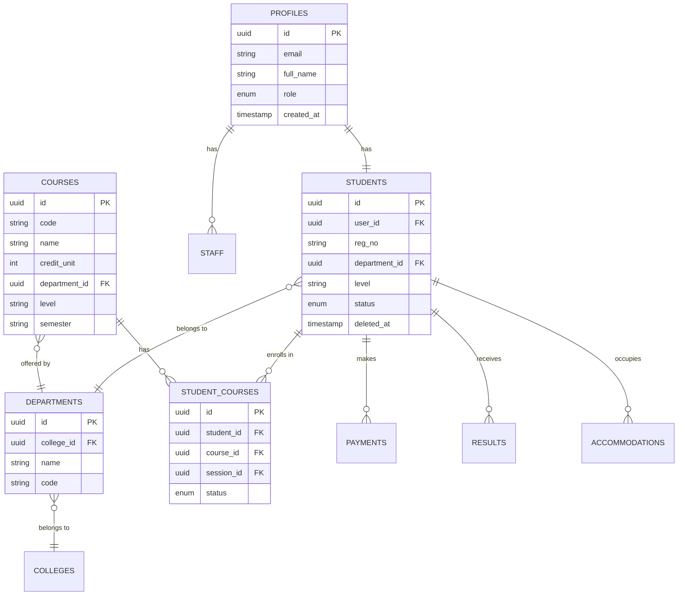

# 🎓 Bells University Student Management System

A comprehensive, enterprise-grade student management system built with modern web technologies, featuring role-based access control, real-time data synchronization, and a premium user interface.

> **Built for**: Bells University of Technology  
> **Purpose**: Streamline academic administration and student lifecycle management

---

## 📋 Table of Contents

- [Overview](#-overview)
- [Features](#-features)
- [Tech Stack](#-tech-stack)
- [Architecture](#-architecture)
- [Database Schema](#-database-schema)
- [Getting Started](#-getting-started)
- [Environment Variables](#-environment-variables)
- [Deployment](#-deployment)
- [Project Structure](#-project-structure)
- [Future Improvements](#-future-improvements)
- [Contributing](#-contributing)
- [License](#-license)

---

## 🌟 Overview

The Bells University Student Management System is a full-featured web application designed to manage the complete student lifecycle from registration to graduation. It provides role-specific interfaces for administrators, staff, and students with comprehensive features for academic records, course management, financial tracking, and reporting.

### Key Highlights

- 🔐 **Secure by Design**: Row-level security, role-based access, audit logging
- ⚡ **Real-time Updates**: Built on Supabase for instant data synchronization
- 🎨 **Premium UX**: Modern, responsive design with smooth animations
- 📊 **Analytics Dashboard**: Role-specific dashboards with key metrics
- 🔄 **Offline-Ready**: Progressive enhancement with graceful degradation
- 🌍 **Scalable**: Cloud-native architecture ready for growth

---

## ✨ Features

### For Administrators

- **Dashboard Analytics**
  - Total students, active/inactive breakdown
  - Department-wise distribution
  - Recent registrations (30-day window)
  - Course enrollment statistics
  - Staff overview

- **Student Management**
  - Add, edit, and soft-delete student records
  - Bulk enrollment operations
  - Advanced search and filtering
  - Export student data

- **Course Management**
  - Create and manage course catalog
  - Set credit units, levels, semesters
  - Department assignments
  - Enrollment tracking per course

- **Financial Oversight**
  - Payment tracking and verification
  - Accommodation assignments
  - Financial reports and analytics

- **System Administration**
  - Audit logs for all system actions
  - User role management
  - System configuration

### For Staff

- **Student Overview**
  - View all student records
  - Department-wise statistics
  - Recent student activity monitoring
  - Student profile management

- **Course Enrollment**
  - Assign courses to students
  - Track enrollment status
  - Manage course registrations
  - Generate enrollment reports

- **Academic Records**
  - View and update student results
  - Grade entry and management
  - Academic performance tracking

### For Students

- **Personal Dashboard**
  - Profile summary with academic details
  - Current session information
  - Registration and payment status
  - Academic summary (enrolled, active, completed courses)

- **Course Management**
  - View available courses
  - Self-registration (when enabled)
  - Course schedule and details
  - Enrolled courses overview with printable form

- **Financial Information**
  - Payment history
  - Outstanding balance
  - Payment receipts
  - Accommodation status

- **Academic Records**
  - View results and grades
  - Academic transcript
  - Performance analytics

---

## 🔧 Tech Stack

### Frontend

| Technology | Purpose | Version |
|------------|---------|---------|
| **React** | UI Framework | 18.x |
| **Vite** | Build Tool & Dev Server | 5.x |
| **React Router** | Client-side Routing | 6.x |
| **Tailwind CSS** | Utility-first Styling | 3.x |
| **Lucide React** | Icon Library | Latest |

### Backend & Services

| Technology | Purpose | Features Used |
|------------|---------|---------------|
| **Supabase** | Backend-as-a-Service | Auth, PostgreSQL, Storage, Realtime |
| **PostgreSQL** | Relational Database | Advanced SQL, RLS, Triggers |

### DevOps & Tools

- **npm** - Package management
- **ESLint** - Code linting
- **Git** - Version control
- **GitHub Actions** - CI/CD (optional)

---

## 🏗️ Architecture

### High-Level Architecture

```
┌─────────────────────────────────────────────────────────────┐
│                        CLIENT TIER                           │
│  ┌────────────┐  ┌────────────┐  ┌────────────┐            │
│  │   React    │  │   Vite     │  │  Tailwind  │            │
│  │  (UI Logic)│  │  (Builder) │  │    (CSS)   │            │
│  └─────┬──────┘  └────────────┘  └────────────┘            │
│        │                                                     │
│        │ HTTP/WebSocket                                     │
└────────┼─────────────────────────────────────────────────────┘
         │
         ▼
┌─────────────────────────────────────────────────────────────┐
│                    SUPABASE PLATFORM                         │
│  ┌──────────────────────────────────────────────────────┐  │
│  │                  AUTHENTICATION                       │  │
│  │  • JWT-based auth  • Role management  • RLS          │  │
│  └──────────────────────────────────────────────────────┘  │
│                                                              │
│  ┌──────────────────────────────────────────────────────┐  │
│  │            POSTGRESQL DATABASE                        │  │
│  │  ┌──────────┐  ┌──────────┐  ┌──────────┐           │  │
│  │  │ Students │  │ Courses  │  │ Payments │           │  │
│  │  │ Profiles │  │  Staff   │  │  Results │           │  │
│  │  │   Dept.  │  │  Enroll. │  │  Accom.  │           │  │
│  │  └──────────┘  └──────────┘  └──────────┘           │  │
│  │                                                       │  │
│  │  • Row Level Security (RLS)                          │  │
│  │  • Database Functions (RPCs)                         │  │
│  │  • Triggers & Constraints                            │  │
│  └──────────────────────────────────────────────────────┘  │
│                                                              │
│  ┌──────────────────────────────────────────────────────┐  │
│  │                    STORAGE                            │  │
│  │  • Student passport photos                           │  │
│  │  • Document uploads                                  │  │
│  └──────────────────────────────────────────────────────┘  │
└──────────────────────────────────────────────────────────────┘
```

### Application Flow

```
User Authentication
        │
        ├─→ Admin Role ──→ Admin Dashboard ──→ Management Features
        │                        │
        │                        ├─→ Student CRUD
        │                        ├─→ Course Management
        │                        ├─→ System Config
        │                        └─→ Audit Logs
        │
        ├─→ Staff Role ──→ Staff Dashboard ──→ Academic Features
        │                        │
        │                        ├─→ Student View
        │                        ├─→ Enrollment Mgmt
        │                        └─→ Results Entry
        │
        └─→ Student Role ──→ Student Dashboard ──→ Self-Service
                                 │
                                 ├─→ Profile View
                                 ├─→ Course Registration
                                 ├─→ Results View
                                 └─→ Payment History
```

### Security Architecture

```
┌─────────────────────────────────────────────┐
│         CLIENT (Browser)                     │
│  • Uses ANON_KEY (public, safe)             │
│  • No direct DB access                      │
└────────────┬────────────────────────────────┘
             │
             │ Authenticated Requests
             ▼
┌─────────────────────────────────────────────┐
│         SUPABASE AUTH                        │
│  • Validates JWT token                      │
│  • Extracts user ID & role                  │
└────────────┬────────────────────────────────┘
             │
             │ auth.uid() + role
             ▼
┌─────────────────────────────────────────────┐
│    ROW LEVEL SECURITY (RLS)                 │
│  ┌────────────────────────────────────┐    │
│  │ Policy: Students view own data     │    │
│  │ WHERE user_id = auth.uid()         │    │
│  └────────────────────────────────────┘    │
│  ┌────────────────────────────────────┐    │
│  │ Policy: Staff view all students    │    │
│  │ WHERE role IN ('staff', 'admin')   │    │
│  └────────────────────────────────────┘    │
└─────────────────────────────────────────────┘
```

---

## 🗄️ Database Schema

### Core Tables



### Key Database Features

**Row Level Security (RLS) Policies:**

| Table | Policy | Rule |
|-------|--------|------|
| `students` | Student view own | `user_id = auth.uid()` |
| `students` | Staff/Admin view all | `role IN ('staff', 'admin')` |
| `payments` | Student view own | `student.user_id = auth.uid()` |
| `results` | Student view own | `student.user_id = auth.uid()` |
| `audit_logs` | Admin only | `role = 'admin'` |

**Database Functions (RPCs):**

- `get_admin_dashboard_stats()` - Comprehensive admin metrics
- `get_staff_dashboard_stats()` - Staff-focused analytics
- `get_student_dashboard_data()` - Student profile and academic data
- `is_admin()` - Helper function for role checking
- `is_staff()` - Helper function for staff validation

**Triggers:**

- `audit_log_trigger` - Automatic audit logging on data changes
- `updated_at_trigger` - Auto-update timestamps

---

## 🚀 Getting Started

### Prerequisites

Ensure you have the following installed:

- **Node.js** 18.x or higher ([Download](https://nodejs.org/))
- **npm** 9.x or higher (comes with Node.js)
- **Git** for version control
- **Supabase Account** ([Sign up](https://supabase.com))

### Installation Steps

#### 1. Clone the Repository

```bash
git clone <repository-url>
cd "KING 2.0/STUDENT MANAGEMENT SYSTEM"
```

#### 2. Install Dependencies

```bash
npm install
```

Expected output:
```
added 234 packages in 15s
```

#### 3. Set Up Supabase Project

1. Go to [supabase.com](https://supabase.com) and create a new project
2. Wait for the project to finish setting up (2-3 minutes)
3. Navigate to **Project Settings** → **API**
4. Copy your:
   - **Project URL** (e.g., `https://abc123.supabase.co`)
   - **Anon (public) key** (starts with `eyJhbGci...`)

#### 4. Configure Environment Variables

Create a `.env` file from the template:

```bash
cp .env.example .env
```

Edit `.env` and add your credentials:

```env
VITE_SUPABASE_URL=https://your-project-id.supabase.co
VITE_SUPABASE_ANON_KEY=your-anon-key-here
```

#### 5. Initialize Database

In your Supabase project dashboard:

1. Go to **SQL Editor**
2. Click **+ New query**
3. Run the following scripts **in order**:

**Step 1: Main Schema**
```sql
-- Copy contents of supabase_complete_schema.sql and run
```

**Step 2: Advanced Features**
```sql
-- Copy contents of supabase_advanced.sql and run
```

**Step 3: Dashboard Functions**
```sql
-- Copy contents of dashboard_rpcs.sql and run
```

#### 6. Start Development Server

```bash
npm run dev
```

Output:
```
VITE v5.x.x  ready in 500 ms

➜  Local:   http://localhost:5173/
➜  Network: use --host to expose
```

#### 7. Access the Application

Open your browser and navigate to:
```
http://localhost:5173
```

#### 8. Create Your First Admin User

1. Click **Register** on the login page
2. Fill in your details and select **Admin** role
3. Check your email for verification link
4. Log in with your credentials

---

## 🔐 Environment Variables

### Required Variables

| Variable | Description | Example | Public/Private |
|----------|-------------|---------|----------------|
| `VITE_SUPABASE_URL` | Your Supabase project URL | `https://abc.supabase.co` | ✅ Public |
| `VITE_SUPABASE_ANON_KEY` | Supabase anonymous key | `eyJhbGci...` | ✅ Public |

### Understanding Security

**Why is the anon key safe to expose?**

The `VITE_SUPABASE_ANON_KEY` is designed for client-side use and is protected by:

1. **Row Level Security (RLS)** - Database policies control data access
2. **Role-based permissions** - Users can only access authorized data
3. **JWT authentication** - All requests are authenticated

**What should NEVER be exposed:**

- ❌ `service_role_key` - Bypasses ALL security
- ❌ Database password - Direct database access
- ❌ `JWT_SECRET` - Can forge authentication tokens

### Setting Up for Different Environments

**Development (`.env`):**
```env
VITE_SUPABASE_URL=https://dev-project.supabase.co
VITE_SUPABASE_ANON_KEY=dev_anon_key
```

**Production (`.env.production`):**
```env
VITE_SUPABASE_URL=https://prod-project.supabase.co
VITE_SUPABASE_ANON_KEY=prod_anon_key
```

> 📚 See the [Environment Variables Guide](./docs/environment-variables.md) for detailed security information.

---

## 🚢 Deployment

### Vercel (Recommended)

**Automatic Deployment:**

1. Push your code to GitHub
2. Go to [vercel.com](https://vercel.com)
3. Click **Import Project**
4. Select your repository
5. Configure:
   - Framework: **Vite**
   - Build Command: `npm run build`
   - Output Directory: `dist`
6. Add environment variables:
   - `VITE_SUPABASE_URL`
   - `VITE_SUPABASE_ANON_KEY`
7. Click **Deploy**

**CLI Deployment:**

```bash
npm install -g vercel
vercel login
vercel --prod
```

### Netlify

1. Connect your Git repository
2. Build settings:
   - **Build command**: `npm run build`
   - **Publish directory**: `dist`
3. Environment variables:
   - Add `VITE_SUPABASE_URL`
   - Add `VITE_SUPABASE_ANON_KEY`
4. Deploy

**CLI Deployment:**

```bash
npm install -g netlify-cli
netlify deploy --prod
```

### Railway

1. Create new project from GitHub repo
2. Add environment variables in dashboard
3. Railway auto-detects Vite and deploys

### Custom Server (VPS/Cloud)

**Build the application:**

```bash
npm run build
```

**Serve with nginx:**

```nginx
server {
    listen 80;
    server_name yourdomain.com;
    root /path/to/dist;
    index index.html;

    location / {
        try_files $uri $uri/ /index.html;
    }
}
```

**Or use a simple Node server:**

```bash
npm install -g serve
serve -s dist -p 3000
```

---

## 📁 Project Structure

```
STUDENT MANAGEMENT SYSTEM/
│
├── public/                      # Static assets
│   └── bells-logo.jpg          # University logo
│
├── src/
│   ├── assets/                 # Images and media
│   │   └── bells-logo.jpg
│   │
│   ├── components/             # Reusable components
│   │   ├── academic/
│   │   │   └── CourseRegistrationForm.jsx
│   │   ├── common/            # Shared UI components
│   │   │   ├── EmptyState.jsx
│   │   │   ├── ErrorBoundary.jsx
│   │   │   ├── ErrorMessage.jsx
│   │   │   ├── FormField.jsx
│   │   │   ├── Loading.jsx
│   │   │   └── ProtectedRoute.jsx
│   │   └── layout/
│   │       └── Navbar.jsx
│   │
│   ├── context/               # React Context
│   │   └── AuthContext.jsx   # Authentication state
│   │
│   ├── pages/                 # Page components
│   │   ├── Academic/
│   │   │   ├── Courses.jsx
│   │   │   ├── Result.jsx
│   │   │   └── Students.jsx
│   │   ├── Admin/
│   │   │   └── AuditLogs.jsx
│   │   ├── Auth/
│   │   │   ├── Login.jsx
│   │   │   ├── Register.jsx
│   │   │   └── Unauthorized.jsx
│   │   ├── Dashboard/
│   │   │   └── Dashboard.jsx
│   │   ├── Finance/
│   │   │   ├── Accommodation.jsx
│   │   │   └── Payments.jsx
│   │   └── Profile/
│   │       └── Profile.jsx
│   │
│   ├── services/              # External services
│   │   └── supabase.js       # Supabase client
│   │
│   ├── utils/                 # Utility functions
│   │   ├── errorHandler.js   # Error handling
│   │   └── logger.js         # Audit logging
│   │
│   ├── App.jsx               # Root component
│   ├── index.css             # Global styles
│   └── main.jsx              # Entry point
│
├── .env.example               # Environment template
├── .gitignore                # Git ignore rules
├── dashboard_rpcs.sql        # Dashboard functions
├── eslint.config.js          # ESLint config
├── index.html                # HTML template
├── package.json              # Dependencies
├── postcss.config.js         # PostCSS config
├── README.md                 # This file
├── supabase_advanced.sql     # Advanced DB features
├── supabase_complete_schema.sql  # Main DB schema
├── tailwind.config.js        # Tailwind config
└── vite.config.js            # Vite config
```

---

## 🔮 Future Improvements

### Short-term (Next Sprint)

- [ ] **Email Notifications**
  - Registration confirmations
  - Payment receipts
  - Course enrollment notifications
  - Result publication alerts

- [ ] **Advanced Search & Filtering**
  - Multi-criteria student search
  - Advanced result filtering
  - Export to CSV/Excel

- [ ] **Bulk Operations**
  - Bulk student upload (CSV)
  - Bulk course registration
  - Batch result entry

- [ ] **Mobile Apps**
  - React Native mobile app
  - Push notifications
  - Offline support

### Mid-term (Next Quarter)

- [ ] **Analytics & Reporting**
  - Custom report builder
  - Data visualization dashboards
  - Export to PDF

- [ ] **Communication Module**
  - In-app messaging
  - Announcement system
  - Email integration

- [ ] **Document Management**
  - Transcript generation
  - Certificate printing
  - Document verification

- [ ] **Timetable Management**
  - Course scheduling
  - Exam timetable
  - Calendar integration

### Long-term (Future Releases)

- [ ] **AI-Powered Features**
  - Predictive analytics for student performance
  - Automated grading suggestions
  - Chatbot for student support

- [ ] **Multi-tenancy**
  - Support multiple universities
  - White-label solution

- [ ] **API Gateway**
  - Public API for integrations
  - Third-party app support
  - Webhook system

- [ ] **Advanced Security**
  - Two-factor authentication (2FA)
  - Biometric authentication
  - Advanced audit trails with anomaly detection

---

## 🤝 Contributing

We welcome contributions from the community! Here's how you can help:

### Getting Started

1. **Fork the repository**
2. **Clone your fork**:
   ```bash
   git clone https://github.com/your-username/student-management-system.git
   ```
3. **Create a feature branch**:
   ```bash
   git checkout -b feature/amazing-feature
   ```
4. **Make your changes**
5. **Commit with descriptive messages**:
   ```bash
   git commit -m "Add: Student bulk upload feature"
   ```
6. **Push to your branch**:
   ```bash
   git push origin feature/amazing-feature
   ```
7. **Open a Pull Request**

### Code Standards

- Follow existing code style
- Write meaningful commit messages
- Add comments for complex logic
- Update documentation as needed
- Test your changes thoroughly

### Reporting Bugs

Open an issue with:
- Clear description
- Steps to reproduce
- Expected vs actual behavior
- Screenshots (if applicable)
- Environment details

---

## 📄 License

This project is licensed under the **MIT License** - see the [LICENSE](LICENSE) file for details.

---

## 🙏 Acknowledgments

- **Bells University of Technology** - For the opportunity to build this system
- **Supabase Team** - For the amazing backend platform
- **React Community** - For the robust ecosystem
- **Open Source Contributors** - For inspiration and tools

---

## 📞 Support & Contact

- **Documentation**: Check the `/docs` folder for detailed guides
- **Issues**: [GitHub Issues](https://github.com/your-repo/issues)
- **Email**: support@bellstech.edu.ng
- **Website**: [bellstech.edu.ng](https://bellstech.edu.ng)

---

<div align="center">

**Built with ❤️ by the Bells University Development Team**

⭐ Star us on GitHub if this project helped you!

</div>
